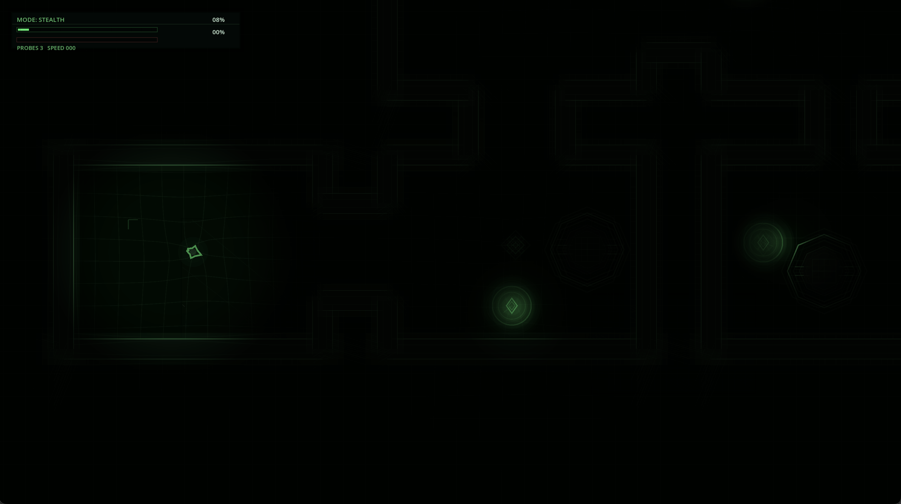
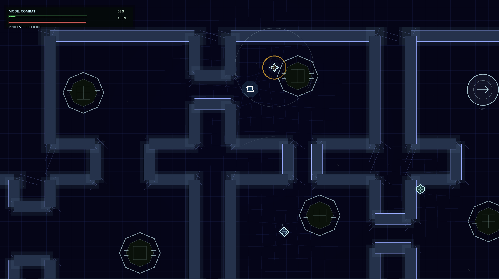

# Signal Dark

`Signal Dark` is a top-down stealth-action prototype built in Godot 4. You pilot a fragile ship through hostile machine spaces, managing visibility, signal output, patrol pressure, hacking, and short combat bursts.

The current project supports two main ways to play:
- Story zones: hand-authored `World` maps across `Zones 01-04`
- Arcade mode: seeded multi-floor runs with `Easy`, `Medium`, and `Hardcore` difficulty

## Screenshots

Stealth visibility, blurred periphery, and Wisp-lit danger pockets:



Combat pressure in a denser machine layout:



## Core Loop

- Move through darkened machine spaces without triggering alerts.
- Use dark mode, hiding pockets, and positioning to stay unreadable.
- Read enemy-specific threat patterns like pulses, beams, proximity zones, and patrol routes.
- Hack gates to progress, at the cost of respawning pressure.
- Survive long enough to reach the exit and advance.

## Run The Game

Requirements:
- Godot 4 in `PATH` as `godot` or `Godot`

Run:

```bash
./run.sh
```

Alternative:

```bash
godot --path .
```

Quick compile check:

```bash
godot --headless --path . --quit
```

## Controls

Keyboard:
- `W A S D`: move
- `Space`: boost
- `Left Shift`: dark mode
- `Left Mouse`: fire
- `E`: suppress
- `Q`: launch probe
- `F` or `Right Mouse`: hack interact
- `J / K / U / I`: hack sequence buttons `A / B / X / Y`
- `R`: reroll arcade seed on the start screen

Controller:
- Left stick / D-pad: move and menu navigation
- `A`: confirm
- `Y`: open enemy index from the start screen
- `Back`: toggle between story and arcade on the start screen
- Face buttons also drive hack sequences

## Start Screen

From the title screen:
- `Enter` / `Space` / `A` / `Start`: start selected mode
- `Tab`, left/right arrows, or controller left/right: switch between story and arcade
- `I` or `Y`: open the enemy info screen
- In arcade mode:
  - `R`: reroll seed
  - `Up/Down` or `W/S`: change difficulty

There is also a hidden level select unlock sequence in the start screen logic.

## Enemies

Current enemy set:
- `Sweeper`
- `Pulsar`
- `Prism`
- `Sentry`
- `Hunter`
- `Wisp`
- `WarpMine`

Use the enemy info screen from the title menu for a quick visual index.

## Project Structure

```text
src/
  arcade/      seeded layout generation and encounter placement
  autoloads/   run state, alert state, input helpers, arcade state
  enemies/     enemy behaviors and scenes
  fx/          color system, overlay, explosions
  player/      ship, probe, weapons
  terrain/     gates, hiding pockets, walls
  ui/          start screen, HUD, overlays, enemy info
  weapons/     projectile logic
  world/       authored maps, arcade world, grid, exits
```

## Notes

- Main scene: [src/ui/StartScreen.tscn](/Users/andrewweeks/repos/signal_dark/src/ui/StartScreen.tscn)
- Arcade scene: [src/world/ArcadeWorld.tscn](/Users/andrewweeks/repos/signal_dark/src/world/ArcadeWorld.tscn)
- Autoload state lives in [project.godot](/Users/andrewweeks/repos/signal_dark/project.godot)

## Testing

The simplest smoke test is:

```bash
godot --headless --path . --quit
```

There is also a test docs stub in [tests/README.md](/Users/andrewweeks/repos/signal_dark/tests/README.md).
